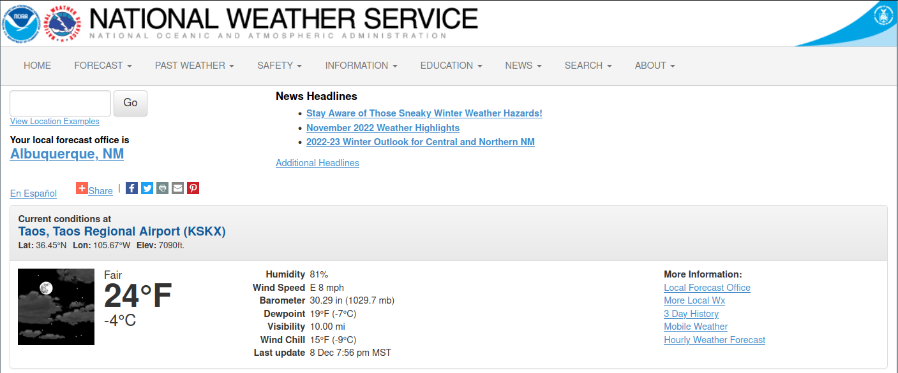

# nws-exporter
Export weather data for consumption with prometheus

Gathers current weather data from the [NWS weather API](https://www.weather.gov/documentation/services-web-api#/) and exports it to be scraped by Prometheus.

## Building

```shell
go build
```

## Usage

```shell
Usage of ./nws-exporter:
  -p int
        Specify port to listen on. Default is 2112. (default 2112)
  -s string
        Specify NWS station. Default is KSKX (Taos, NM). (default "KSKX")
```

## Known Issues

It prints the following message every time it's scraped, but this does not impact functionality.

```
json: cannot unmarshal string into Go struct field weather.Properties of type struct { UnitCode string "json:'unitCode'"; Value float64 "json:'value'" }
```

## Find Your Station

Search your city/state or zip code on [weather.gov](https://www.weather.gov), then your station will be shown in the forecast.

